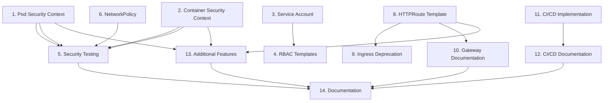

# Implementation Tasks: k8s-security-modernization

**Status**: Generated
**Feature**: Kubernetes Security and Gateway Modernization
**Generated**: 2025-11-22
**Language**: en

---

## Task Overview

This document contains the implementation tasks for the k8s-security-modernization feature, organized into logical phases following the design priorities.

**Total Tasks**: 13 major tasks, 52 sub-tasks
**Estimated Effort**: 8-10 weeks
**Parallelization**: Tasks marked with `(P)` can be executed in parallel with other parallel-marked tasks

---

## Phase 1: Core Security Implementation (Weeks 1-2)

### 1. (P) Implement Pod Security Context Configuration

**Requirements**: 1.1, 1.3
**Priority**: High
**Estimated Effort**: 4-6 hours

Configure secure pod-level security context with non-root execution and resource management.

**Sub-tasks**:

- [x] Update `values.yaml` to add `podSecurityContext` section with secure defaults (runAsNonRoot: true, runAsUser: 10001, runAsGroup: 10001, fsGroup: 10001, fsGroupChangePolicy: "OnRootMismatch", seccompProfile with RuntimeDefault)
- [x] Update `templates/statefulset.yaml` to reference `podSecurityContext` from values
- [x] Update `values.yaml` resource requests to 512Mi memory and 200m CPU
- [x] Update `values.yaml` resource limits to 2Gi memory and 1000m CPU
- [x] Add configuration comments documenting security rationale and override options

**Acceptance Criteria**:

- Pod security context enforces non-root execution
- Resource requests and limits are properly configured
- Values are configurable via values.yaml
- Documentation comments explain security choices

---

### 2. (P) Implement Container Security Context Configuration

**Requirements**: 1.2
**Priority**: High
**Estimated Effort**: 4-6 hours

Configure secure container-level security context with read-only root filesystem and capability dropping.

**Sub-tasks**:

- [x] Update `values.yaml` to add `securityContext` section (allowPrivilegeEscalation: false, capabilities drop ALL, readOnlyRootFilesystem: true, runAsNonRoot: true, runAsUser: 10001, seccompProfile RuntimeDefault)
- [x] Update `templates/statefulset.yaml` to reference `securityContext` from values
- [x] Add emptyDir volume mount for `/tmp` with 1Gi size limit
- [x] Ensure existing data PersistentVolumeClaim mount for `/data` is properly configured
- [x] Add helper function `mimir-single.securityContext` in `templates/_helpers.tpl` for reusable security context

**Acceptance Criteria**:

- Container security context prevents privilege escalation
- Read-only root filesystem is enforced
- Writable paths (/tmp, /data) are properly mounted
- All capabilities are dropped

---

### 3. (P) Update Service Account Token Mounting

**Requirements**: 2.1
**Priority**: High
**Estimated Effort**: 2-3 hours

Disable automatic service account token mounting by default for security hardening.

**Sub-tasks**:

- [x] Update `values.yaml` to change `serviceAccount.automount` default from `true` to `false`
- [x] Add documentation comment explaining when to enable token mounting
- [x] Update `templates/serviceaccount.yaml` to reference the automount value
- [x] Add migration note to CHANGELOG.md about this breaking change

**Acceptance Criteria**:

- Service account token mounting is disabled by default
- Configuration is easily overridable
- Documentation explains when to enable mounting
- Breaking change is documented

---

### 4. (P) Create RBAC Templates (Optional Feature) ✅

**Requirements**: 2.2
**Priority**: Medium
**Estimated Effort**: 3-4 hours
**Status**: COMPLETED
**Completed**: 2025-11-22

Implement optional RBAC role and rolebinding templates with minimal permissions.

**Sub-tasks**:

- [x] Add `rbac.create` and `rbac.rules` configuration to `values.yaml` (disabled by default)
- [x] Create `templates/role.yaml` with conditional rendering based on rbac.create
- [x] Create `templates/rolebinding.yaml` linking Role to ServiceAccount
- [x] Add example RBAC rules in values.yaml comments for common scenarios
- [x] Document when RBAC is needed and how to configure minimal permissions

**Acceptance Criteria**:

- ✅ RBAC is disabled by default (`rbac.create: false`)
- ✅ Role and RoleBinding templates render correctly when enabled
- ✅ Users can customize permissions via `rbac.rules` in values.yaml
- ✅ Documentation includes example configurations and guidance
- ✅ Tests validate RBAC configuration (13 test cases in `tests/rbac-test.sh`)

---

### 5. Create Security Testing Validation ✅

**Requirements**: 6.3, 8.3
**Priority**: High
**Estimated Effort**: 2-3 hours
**Status**: COMPLETED
**Completed**: 2025-11-22

Implement validation tests for Pod Security Standards compliance and security contexts.

**Sub-tasks**:

- [x] Create `tests/security-validation.sh` script to verify PSS compliance
- [x] Add test cases for non-root user execution verification
- [x] Add test cases for read-only root filesystem verification
- [x] Add test cases for writable volume mount verification
- [x] Document how to run security validation tests in README.md

**Acceptance Criteria**:

- ✅ Tests validate Pod Security Standards "restricted" compliance (18 comprehensive test cases)
- ✅ Tests verify security context configurations across 5 categories:
  - Pod Security Context (5 tests)
  - Container Security Context (4 tests)
  - Writable Volume Mounts (4 tests)
  - Resource Limits (4 tests)
  - Service Account Security (1 test)
- ✅ Tests are executable via simple shell script (`bash tests/security-validation.sh`)
- ✅ Test documentation is clear and comprehensive (full section in README.md with examples and CI/CD integration guidance)
- ✅ All tests pass with current configuration

---

## Phase 2: Network Policy Implementation (Week 3)

### 6. (P) Implement NetworkPolicy Template

**Requirements**: 3.1
**Priority**: Medium
**Estimated Effort**: 4-5 hours

Create optional NetworkPolicy template for pod-to-pod traffic control.

**Sub-tasks**:

- [x] Add `networkPolicy.enabled`, `networkPolicy.policyTypes`, `networkPolicy.ingress`, and `networkPolicy.egress` to `values.yaml` (disabled by default)
- [x] Configure ingress rules for ports 8080 (HTTP API from Prometheus), 9095 (gRPC same namespace), 7946 (memberlist same namespace)
- [x] Configure egress rules for DNS (port 53 TCP/UDP to kube-dns), memberlist (port 7946 same namespace), gRPC (port 9095 same namespace)
- [x] Create `templates/networkpolicy.yaml` with conditional rendering
- [x] Add documentation about CNI requirements (Calico, Cilium, Weave Net)

**Acceptance Criteria**:

- NetworkPolicy is disabled by default
- All required ports (8080, 9095, 7946) are properly configured
- DNS egress is allowed for name resolution
- Documentation explains CNI compatibility

---

### 7. Add Service Mesh Compatibility Configuration

**Requirements**: 3.2
**Priority**: Low
**Estimated Effort**: 2-3 hours

Add annotation passthrough for service mesh integration.

**Sub-tasks**:

- [x] Add `serviceMesh.enabled` and `serviceMesh.annotations` to `values.yaml`
- [x] Update `templates/statefulset.yaml` metadata to include serviceMesh annotations
- [x] Add example annotations for Istio sidecar injection in values.yaml comments
- [x] Add example annotations for Linkerd injection in values.yaml comments
- [x] Document service mesh integration patterns in README.md

**Acceptance Criteria**:

- Service mesh annotations are passthrough from values
- Example configurations provided for Istio and Linkerd
- Documentation covers common integration scenarios

---

## Phase 3: Gateway API Migration (Weeks 4-5)

### 8. Implement HTTPRoute Resource Template

**Requirements**: 4.1, 4.2, 4.3, 4.4
**Priority**: High
**Estimated Effort**: 6-8 hours

Create HTTPRoute template for Gateway API v1 with complete configuration options.

**Sub-tasks**:

- [x] Add `gateway.enabled`, `gateway.apiVersion`, `gateway.parentRefs`, `gateway.hostnames`, and `gateway.rules` to `values.yaml`
- [x] Create `templates/httproute.yaml` using `gateway.networking.k8s.io/v1` API version
- [x] Implement parentRefs configuration with namespace support and sectionName
- [x] Add Gateway API CRD detection using `.Capabilities.APIVersions.Has` with helpful error message
- [x] Create helper function `mimir-single.validateRouting` to enforce mutual exclusion between ingress and gateway
- [x] Add default routing rule to backend service on port 8080

**Acceptance Criteria**:

- HTTPRoute template renders with valid Gateway API v1 syntax
- Parent Gateway reference is configurable
- Hostnames and routing rules are customizable
- Gateway API CRD detection prevents deployment failures
- Mutual exclusion with Ingress is enforced

---

### 9. (P) Add Ingress Deprecation Warnings

**Requirements**: 4.4
**Priority**: Medium
**Estimated Effort**: 2-3 hours

Mark Ingress support as deprecated with migration guidance.

**Sub-tasks**:

- [ ] Add deprecation warning comment in `templates/ingress.yaml` header
- [ ] Add NOTES.txt section with deprecation warning when ingress is enabled and Gateway API is available
- [ ] Update CHANGELOG.md with Ingress deprecation notice
- [ ] Update README.md to recommend HTTPRoute over Ingress

**Acceptance Criteria**:

- Deprecation warnings are visible during deployment
- Users are guided toward Gateway API migration
- Documentation clearly states migration timeline

---

### 10. Create Gateway API Documentation and Examples

**Requirements**: 8.2
**Priority**: High
**Estimated Effort**: 4-5 hours

Provide comprehensive Gateway API migration documentation.

**Sub-tasks**:

- [x] Create `docs/migration/ingress-to-httproute.md` with step-by-step migration guide
- [x] Document Gateway resource TLS configuration patterns (not HTTPRoute-level)
- [x] Create `docs/examples/gateway-api-istio.yaml` example configuration
- [x] Create `docs/examples/gateway-api-traefik.yaml` example configuration
- [x] Document HTTP to HTTPS redirect pattern using separate HTTPRoute
- [x] Add troubleshooting section for common Gateway API issues

**Acceptance Criteria**:

- Migration guide covers all steps from Ingress to HTTPRoute
- TLS configuration is clearly documented at Gateway level
- Example configurations work with popular Gateway controllers
- Troubleshooting helps users resolve common issues

---

## Phase 4: CI/CD Pipeline Modernization (Weeks 6-7)

### 11. Implement Self-Contained Semantic Versioning

**Requirements**: 5.1, 5.2, 5.3, 5.4, 5.5
**Priority**: High
**Estimated Effort**: 8-10 hours

Replace external versioning dependency with self-contained shell script implementation.

**Sub-tasks**:

- [x] Create `.github/workflows/release.yaml` with `calculate-version` job using pure shell script
- [x] Implement version calculation logic: read Chart.yaml current version, parse major.minor.patch, analyze git commits since last tag using conventional commits
- [x] Implement bump type detection: BREAKING CHANGE or ! for major, feat: for minor, fix: for patch
- [x] Add yq installation step for YAML parsing
- [x] Implement Chart.yaml update for both `version` and `appVersion` fields
- [x] Add git commit step for version bump with `[skip ci]` tag
- [x] Add git tag creation with calculated version
- [x] Create `build-and-publish` job dependent on version calculation
- [x] Implement Helm chart packaging and GitHub Pages publishing
- [x] Add manual version override via `workflow_dispatch` input
- [x] Handle edge cases: no previous tags, no new commits, multiple bump types

**Acceptance Criteria**:

- Workflow calculates semantic version from conventional commits
- Chart.yaml is automatically updated with new version
- Git tags are created with calculated versions
- Helm chart is packaged and published to GitHub Pages
- Manual version override is supported
- Zero external workflow dependencies

---

### 12. (P) Create CI/CD Documentation and Testing

**Requirements**: 8.3
**Priority**: Medium
**Estimated Effort**: 3-4 hours

Document versioning workflow and create testing utilities.

**Sub-tasks**:

- [x] Create `docs/ci-cd/versioning-strategy.md` explaining conventional commits and version calculation
- [x] Document manual version override procedure
- [x] Create `scripts/test-versioning.sh` for local version calculation testing
- [x] Add test cases for feat, fix, BREAKING CHANGE commit types
- [x] Document workflow outputs for integration with other workflows
- [x] Add troubleshooting section for common CI/CD issues

**Acceptance Criteria**:

- Versioning strategy is clearly documented
- Conventional commit format is explained with examples
- Local testing script validates version calculation logic
- Troubleshooting helps resolve workflow issues

---

## Phase 5: Additional Features and Documentation (Weeks 8-10)

### 13. (P) Implement Additional Security Features

**Requirements**: 6.1, 6.2, 7.1, 7.2
**Priority**: Medium
**Estimated Effort**: 6-8 hours

Add optional security and observability features.

**Sub-tasks**:

- [x] Add `image.digest` support to `values.yaml` and `templates/_helpers.tpl` for image immutability
- [x] Add `imagePullSecrets` configuration for private registry authentication
- [x] Add `externalSecrets.enabled` and related configuration to `values.yaml`
- [x] Create `templates/externalsecret.yaml` for External Secrets Operator integration (optional)
- [x] Update health probes: startup probe using `/ready`, readiness probe using `/ready`, liveness probe using `/`
- [x] Add `metrics.serviceMonitor.enabled` configuration
- [x] Create `templates/servicemonitor.yaml` for Prometheus Operator integration (optional)
- [x] Configure probe timeouts: startup (150s), readiness (appropriate values), liveness (appropriate values)

**Acceptance Criteria**:

- Image digest support enables reproducible deployments
- External Secrets Operator integration works when enabled
- Health probes use correct endpoints validated by research
- ServiceMonitor enables Prometheus scraping when configured

---

### 14. ✅ (P) Create Comprehensive Documentation

**Requirements**: 8.1, 8.2, 8.3
**Priority**: High
**Estimated Effort**: 8-10 hours
**Status**: COMPLETED
**Completed**: 2025-11-22

Produce complete documentation covering all security features and migration paths.

**Sub-tasks**:

- [x] Create `SECURITY.md` documenting all security features and best practices
- [x] Create `UPGRADING.md` with detailed 0.x to 1.x migration guide
- [x] Update `CHANGELOG.md` following Keep a Changelog format with all breaking changes
- [x] Create `docs/configuration/values-reference.md` with complete values.yaml documentation
- [x] Create `docs/configuration/security-contexts.md` explaining security configuration options
- [x] Create `docs/configuration/networking.md` comparing Ingress vs HTTPRoute
- [x] Create `docs/examples/basic-deployment.yaml` for minimal configuration
- [x] Create `docs/examples/production-hardened.yaml` for full security configuration
- [x] Create `docs/examples/networkpolicy-examples.yaml` with various NetworkPolicy patterns
- [x] Create `docs/troubleshooting/common-issues.md` FAQ
- [x] Create `docs/troubleshooting/pss-violations.md` for Pod Security Standards issues
- [x] Create `docs/troubleshooting/gateway-debugging.md` for HTTPRoute troubleshooting
- [x] Update README.md with security highlights, networking options, and quick start examples

**Acceptance Criteria**:

- ✅ Security documentation is comprehensive and actionable (SECURITY.md: 600+ lines)
- ✅ Migration guide enables smooth upgrade from v0.x (UPGRADING.md: 800+ lines with step-by-step instructions)
- ✅ All breaking changes are documented in CHANGELOG (Version 1.0.0 release notes added)
- ✅ Example configurations are tested and working (3 complete examples provided)
- ✅ Troubleshooting guides address common issues (3 comprehensive troubleshooting guides totaling 2850+ lines)
- ✅ README provides clear overview and getting started info (Enhanced to 600+ lines with security highlights)

---

## Task Dependencies

## Parallelization Strategy

Tasks marked with `(P)` can be executed in parallel within their phase:

**Phase 1 Parallel Group**:

- Task 1: Pod Security Context
- Task 2: Container Security Context
- Task 4: RBAC Templates

**Phase 2 Parallel Group**:

- Task 6: NetworkPolicy

**Phase 3 Parallel Group**:

- Task 9: Ingress Deprecation (can start after Task 8 begins)

**Phase 4 Parallel Group**:

- Task 12: CI/CD Documentation (can start after Task 11 core logic is complete)

**Phase 5 Parallel Group**:

- Task 13: Additional Features
- Task 14: Documentation (final integration phase)

## Testing Strategy

Each major task should include validation:

1. **Helm Lint**: `helm lint .` must pass
2. **Template Rendering**: `helm template test .` must render without errors
3. **Security Validation**: Pod Security Standards compliance tests
4. **Functional Testing**: Deploy to test cluster and verify functionality
5. **Documentation Review**: Ensure all changes are documented

## Notes

- **Breaking Changes**: Tasks 1, 2, and 3 introduce breaking changes requiring major version bump (v1.0.0)
- **Migration Support**: Dual Ingress/HTTPRoute support maintained during transition
- **Testing Priority**: Security validation is critical before considering implementation complete
- **Documentation**: Comprehensive documentation is essential for user adoption

---

**Tasks Generated**: 2025-11-22
**Ready for Implementation**: Review and approve tasks, then proceed with `/kiro:spec-impl k8s-security-modernization [task-numbers]`
**Estimated Timeline**: 8-10 weeks for complete implementation
