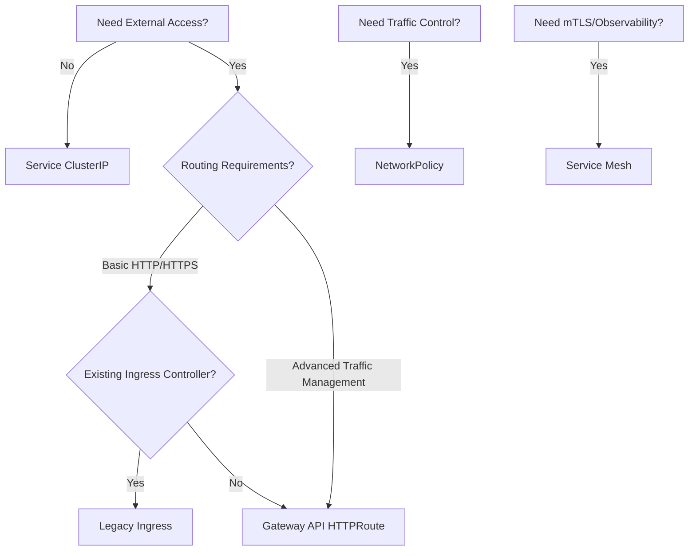

# Networking Configuration

Comprehensive guide to network configuration options including Ingress, Gateway API, NetworkPolicy, and Service Mesh integration.

## Table of Contents

- [Overview](#overview)
- [Service Configuration](#service-configuration)
- [Ingress vs Gateway API](#ingress-vs-gateway-api)
- [Legacy Ingress Configuration](#legacy-ingress-configuration)
- [Gateway API HTTPRoute](#gateway-api-httproute)
- [NetworkPolicy Configuration](#networkpolicy-configuration)
- [Service Mesh Integration](#service-mesh-integration)
- [Best Practices](#best-practices)

## Overview

The mimir-single chart supports multiple networking approaches:

| Feature | Use Case | Maturity | Recommendation |
|---------|----------|----------|----------------|
| **Service** | Internal cluster access | Stable | Always enabled |
| **Ingress** | HTTP routing (legacy) | Stable | Use for existing setups |
| **Gateway API** | Modern HTTP routing | GA (v1.0) | Recommended for new deployments |
| **NetworkPolicy** | Pod traffic control | Stable | Recommended for production |
| **Service Mesh** | mTLS, observability | Stable | Optional, for advanced use cases |

### Decision Matrix



## Service Configuration

The Kubernetes Service provides internal cluster access to Mimir.

### Basic Configuration

```yaml
service:
  type: ClusterIP
  port: 9009
```

### Service Types

#### ClusterIP (Default)

**Use Case**: Internal cluster-only access

```yaml
service:
  type: ClusterIP
  port: 9009
```

**Access**:
```bash
# From within cluster
curl http://mimir-single:9009/ready

# Port-forward for local testing
kubectl port-forward svc/mimir-single 9009:9009
```

#### LoadBalancer

**Use Case**: Direct external access (cloud environments)

```yaml
service:
  type: LoadBalancer
  port: 9009
```

**Access**:
```bash
# Get external IP
kubectl get svc mimir-single

# Access directly
curl http://<EXTERNAL-IP>:9009/ready
```

**Cost Consideration**: Creates cloud load balancer (incurs charges).

#### NodePort

**Use Case**: External access without load balancer

```yaml
service:
  type: NodePort
  port: 9009
```

**Access**:
```bash
# Get node port
kubectl get svc mimir-single

# Access via node IP
curl http://<NODE-IP>:<NODE-PORT>/ready
```

**Limitations**: Exposes service on all nodes, ports 30000-32767.

## Ingress vs Gateway API

### Comparison

| Feature | Ingress | Gateway API |
|---------|---------|-------------|
| **Maturity** | Stable (v1) | GA (v1.0) |
| **Spec** | Single resource | Multi-resource (Gateway + HTTPRoute) |
| **Ownership** | Application owns routing | Platform owns Gateway, app owns routes |
| **Features** | Basic HTTP routing | Advanced traffic management |
| **Header Matching** | Limited | Full support |
| **Weighted Traffic** | No | Yes |
| **Path Rewrites** | Limited | Full support |
| **Backend Protocol** | HTTP only | HTTP, HTTPS, gRPC |
| **Multi-Namespace** | No | Yes |

### When to Use Each

**Use Ingress When**:
- Existing Ingress controller deployed
- Simple HTTP/HTTPS routing sufficient
- Team familiar with Ingress
- Migration cost outweighs Gateway API benefits

**Use Gateway API When**:
- New deployment
- Advanced traffic management needed
- Multi-team shared infrastructure
- Progressive delivery requirements
- Future-proofing architecture

## Legacy Ingress Configuration

Traditional Ingress for HTTP routing. Still supported but Gateway API is recommended for new deployments.

### Basic Ingress

```yaml
ingress:
  enabled: true
  className: nginx
  hosts:
    - host: mimir.example.com
      paths:
        - path: /
          pathType: Prefix
```

### Ingress with TLS

```yaml
ingress:
  enabled: true
  className: nginx
  annotations:
    cert-manager.io/cluster-issuer: letsencrypt-prod
  hosts:
    - host: mimir.example.com
      paths:
        - path: /
          pathType: Prefix
  tls:
    - secretName: mimir-tls
      hosts:
        - mimir.example.com
```

### NGINX Ingress Examples

#### Basic Authentication

```yaml
ingress:
  enabled: true
  className: nginx
  annotations:
    nginx.ingress.kubernetes.io/auth-type: basic
    nginx.ingress.kubernetes.io/auth-secret: mimir-basic-auth
    nginx.ingress.kubernetes.io/auth-realm: 'Authentication Required'
  hosts:
    - host: mimir.example.com
      paths:
        - path: /
          pathType: Prefix
```

#### Rate Limiting

```yaml
ingress:
  enabled: true
  className: nginx
  annotations:
    nginx.ingress.kubernetes.io/limit-rps: "100"
    nginx.ingress.kubernetes.io/limit-connections: "10"
  hosts:
    - host: mimir.example.com
      paths:
        - path: /
          pathType: Prefix
```

#### Custom Timeouts

```yaml
ingress:
  enabled: true
  className: nginx
  annotations:
    nginx.ingress.kubernetes.io/proxy-connect-timeout: "60"
    nginx.ingress.kubernetes.io/proxy-send-timeout: "60"
    nginx.ingress.kubernetes.io/proxy-read-timeout: "60"
  hosts:
    - host: mimir.example.com
      paths:
        - path: /
          pathType: Prefix
```

## Gateway API HTTPRoute

Modern, feature-rich HTTP routing using Kubernetes Gateway API.

### Prerequisites

1. **Install Gateway API CRDs**:
```bash
kubectl apply -f https://github.com/kubernetes-sigs/gateway-api/releases/download/v1.0.0/standard-install.yaml
```

2. **Deploy Gateway Controller** (choose one):
   - **Istio**: `istioctl install`
   - **Contour**: `kubectl apply -f https://projectcontour.io/quickstart/contour.yaml`
   - **NGINX**: `helm install nginx-gateway oci://ghcr.io/nginxinc/charts/nginx-gateway-fabric`

3. **Create Gateway Resource**:
```yaml
apiVersion: gateway.networking.k8s.io/v1
kind: Gateway
metadata:
  name: example-gateway
  namespace: gateway-system
spec:
  gatewayClassName: istio  # or nginx, contour, etc.
  listeners:
    - name: http
      protocol: HTTP
      port: 80
      hostname: "*.example.com"
    - name: https
      protocol: HTTPS
      port: 443
      hostname: "*.example.com"
      tls:
        mode: Terminate
        certificateRefs:
          - name: example-com-tls
```

### Basic HTTPRoute

```yaml
gateway:
  httproute:
    enabled: true
    parentRefs:
      - name: example-gateway
        namespace: gateway-system
    hostnames:
      - mimir.example.com
    rules:
      - matches:
        - path:
            type: PathPrefix
            value: /
        backendRefs:
        - name: mimir-single
          port: 9009
```

### Advanced HTTPRoute Examples

#### Path-Based Routing

```yaml
gateway:
  httproute:
    enabled: true
    parentRefs:
      - name: example-gateway
        namespace: gateway-system
    hostnames:
      - mimir.example.com
    rules:
      # API endpoints
      - matches:
        - path:
            type: PathPrefix
            value: /api/
        backendRefs:
        - name: mimir-single
          port: 9009

      # Metrics endpoint
      - matches:
        - path:
            type: Exact
            value: /metrics
        backendRefs:
        - name: mimir-single
          port: 9009
```

#### Header-Based Routing

```yaml
gateway:
  httproute:
    enabled: true
    parentRefs:
      - name: example-gateway
        namespace: gateway-system
    hostnames:
      - mimir.example.com
    rules:
      # Production traffic
      - matches:
        - headers:
          - name: X-Version
            value: v1
        backendRefs:
        - name: mimir-single-v1
          port: 9009

      # Beta traffic
      - matches:
        - headers:
          - name: X-Version
            value: v2
        backendRefs:
        - name: mimir-single-v2
          port: 9009
```

#### Weighted Traffic Splitting (Canary)

```yaml
gateway:
  httproute:
    enabled: true
    parentRefs:
      - name: example-gateway
        namespace: gateway-system
    hostnames:
      - mimir.example.com
    rules:
      - matches:
        - path:
            type: PathPrefix
            value: /
        backendRefs:
        # 90% to stable version
        - name: mimir-single-stable
          port: 9009
          weight: 90
        # 10% to canary version
        - name: mimir-single-canary
          port: 9009
          weight: 10
```

#### URL Rewrites

```yaml
gateway:
  httproute:
    enabled: true
    parentRefs:
      - name: example-gateway
        namespace: gateway-system
    hostnames:
      - mimir.example.com
    rules:
      - matches:
        - path:
            type: PathPrefix
            value: /mimir
        filters:
        - type: URLRewrite
          urlRewrite:
            path:
              type: ReplacePrefixMatch
              replacePrefixMatch: /
        backendRefs:
        - name: mimir-single
          port: 9009
```

#### Request Header Manipulation

```yaml
gateway:
  httproute:
    enabled: true
    parentRefs:
      - name: example-gateway
        namespace: gateway-system
    hostnames:
      - mimir.example.com
    rules:
      - matches:
        - path:
            type: PathPrefix
            value: /
        filters:
        # Add headers
        - type: RequestHeaderModifier
          requestHeaderModifier:
            add:
              - name: X-Environment
                value: production
              - name: X-Team
                value: platform
            # Remove headers
            remove:
              - X-Internal-Debug
        backendRefs:
        - name: mimir-single
          port: 9009
```

#### Redirects

```yaml
gateway:
  httproute:
    enabled: true
    parentRefs:
      - name: example-gateway
        namespace: gateway-system
    hostnames:
      - mimir.example.com
    rules:
      # Redirect HTTP to HTTPS
      - matches:
        - path:
            type: PathPrefix
            value: /
        filters:
        - type: RequestRedirect
          requestRedirect:
            scheme: https
            statusCode: 301
```

## NetworkPolicy Configuration

Control pod-to-pod and pod-to-external network traffic.

### Default Deny Policy

Blocks all traffic except what's explicitly allowed:

```yaml
networkPolicy:
  enabled: true
  policyTypes:
    - Ingress
    - Egress
  ingress: []  # Deny all ingress by default
  egress: []   # Deny all egress by default
```

### Common Patterns

#### Allow Grafana Access

```yaml
networkPolicy:
  enabled: true
  ingress:
    - from:
      - podSelector:
          matchLabels:
            app.kubernetes.io/name: grafana
      ports:
      - protocol: TCP
        port: 9009
```

#### Allow Specific Namespace

```yaml
networkPolicy:
  enabled: true
  ingress:
    - from:
      - namespaceSelector:
          matchLabels:
            name: monitoring
      ports:
      - protocol: TCP
        port: 9009
```

#### Allow DNS

```yaml
networkPolicy:
  enabled: true
  egress:
    # Allow DNS queries
    - to:
      - namespaceSelector:
          matchLabels:
            name: kube-system
      - podSelector:
          matchLabels:
            k8s-app: kube-dns
      ports:
      - protocol: UDP
        port: 53
      - protocol: TCP
        port: 53
```

#### Allow Object Storage (S3/GCS)

```yaml
networkPolicy:
  enabled: true
  egress:
    # Allow HTTPS to any destination
    - to:
      - namespaceSelector: {}
      ports:
      - protocol: TCP
        port: 443
```

#### Complete Production Example

```yaml
networkPolicy:
  enabled: true
  policyTypes:
    - Ingress
    - Egress

  ingress:
    # Allow Grafana
    - from:
      - podSelector:
          matchLabels:
            app.kubernetes.io/name: grafana
      ports:
      - protocol: TCP
        port: 9009

    # Allow Prometheus
    - from:
      - podSelector:
          matchLabels:
            app: prometheus
      ports:
      - protocol: TCP
        port: 9009

  egress:
    # Allow DNS
    - to:
      - namespaceSelector:
          matchLabels:
            name: kube-system
      ports:
      - protocol: UDP
        port: 53

    # Allow object storage (S3/GCS)
    - to:
      - namespaceSelector: {}
      ports:
      - protocol: TCP
        port: 443

    # Allow Kubernetes API (if needed)
    - to:
      - namespaceSelector: {}
      - podSelector:
          matchLabels:
            component: apiserver
      ports:
      - protocol: TCP
        port: 443
```

See [../examples/networkpolicy-examples.yaml](../examples/networkpolicy-examples.yaml) for more patterns.

## Service Mesh Integration

Advanced traffic management, mTLS, and observability with service meshes.

### Istio Integration

#### Basic Configuration

```yaml
serviceMesh:
  enabled: true
  type: istio
  annotations:
    sidecar.istio.io/inject: "true"
```

#### Advanced Istio Configuration

```yaml
serviceMesh:
  enabled: true
  type: istio
  annotations:
    # Sidecar injection
    sidecar.istio.io/inject: "true"

    # Traffic policy
    traffic.sidecar.istio.io/includeInboundPorts: "9009"
    traffic.sidecar.istio.io/excludeOutboundPorts: ""

    # Resource limits
    sidecar.istio.io/proxyCPU: "100m"
    sidecar.istio.io/proxyMemory: "128Mi"

    # Logging
    sidecar.istio.io/logLevel: "info"
```

#### Istio mTLS

```yaml
# Create PeerAuthentication for mTLS
apiVersion: security.istio.io/v1beta1
kind: PeerAuthentication
metadata:
  name: mimir-mtls
spec:
  selector:
    matchLabels:
      app.kubernetes.io/name: mimir-single
  mtls:
    mode: STRICT  # Require mTLS

---
# Chart values
serviceMesh:
  enabled: true
  type: istio
```

### Linkerd Integration

#### Basic Configuration

```yaml
serviceMesh:
  enabled: true
  type: linkerd
  annotations:
    linkerd.io/inject: enabled
```

#### Advanced Linkerd Configuration

```yaml
serviceMesh:
  enabled: true
  type: linkerd
  annotations:
    # Proxy injection
    linkerd.io/inject: enabled

    # Skip ports
    config.linkerd.io/skip-inbound-ports: "3306"
    config.linkerd.io/skip-outbound-ports: "3307"

    # Tracing
    config.linkerd.io/trace-collector: jaeger.tracing:9411
```

## Best Practices

### Networking Strategy

**✅ Do**:
- ✅ Use Gateway API for new deployments
- ✅ Enable NetworkPolicy in production
- ✅ Start with deny-all, add rules incrementally
- ✅ Use Service Mesh for microservices architectures
- ✅ Test network policies in non-production first
- ✅ Document all network rules and their purposes
- ✅ Use meaningful label selectors
- ✅ Implement defense in depth (multiple layers)

**❌ Don't**:
- ❌ Expose services directly with LoadBalancer (use Ingress/Gateway)
- ❌ Allow all traffic with empty NetworkPolicy rules
- ❌ Mix Ingress and Gateway API for same service
- ❌ Ignore egress NetworkPolicy rules
- ❌ Deploy to production without NetworkPolicy
- ❌ Use wildcards excessively in NetworkPolicy

### Security Checklist

Before deploying to production:

- [ ] NetworkPolicy enabled with explicit rules
- [ ] Ingress/HTTPRoute configured with TLS
- [ ] Service type appropriate for environment
- [ ] Network rules tested and validated
- [ ] Service Mesh mTLS enabled (if using mesh)
- [ ] DNS egress explicitly allowed
- [ ] External service egress explicitly allowed
- [ ] Monitoring/observability access configured
- [ ] Backup/disaster recovery access configured
- [ ] Documentation updated with network diagram

### Troubleshooting Network Issues

See [../troubleshooting/](../troubleshooting/) for detailed guides:
- [common-issues.md](../troubleshooting/common-issues.md): General networking problems
- [gateway-debugging.md](../troubleshooting/gateway-debugging.md): Gateway API specific issues
- [pss-violations.md](../troubleshooting/pss-violations.md): Security policy conflicts

## Related Documentation

- [Gateway API Documentation](https://gateway-api.sigs.k8s.io/)
- [NetworkPolicy Documentation](https://kubernetes.io/docs/concepts/services-networking/network-policies/)
- [Istio Documentation](https://istio.io/latest/docs/)
- [Linkerd Documentation](https://linkerd.io/docs/)
- [values-reference.md](./values-reference.md): Complete configuration reference
- [SECURITY.md](../../SECURITY.md): Security features and best practices
